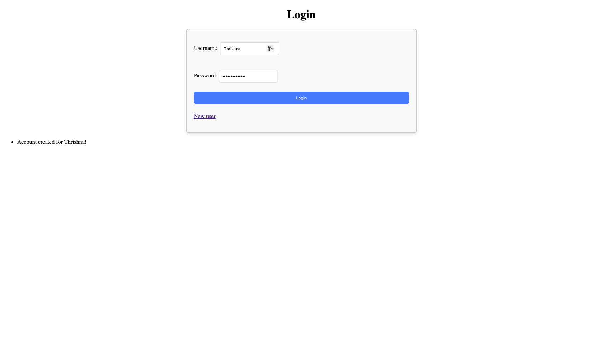
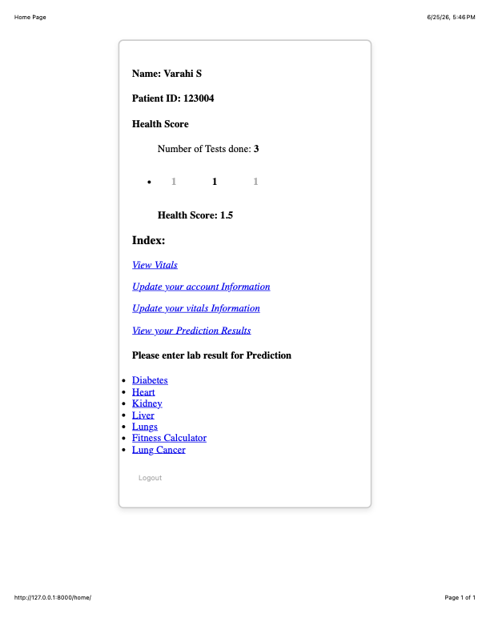
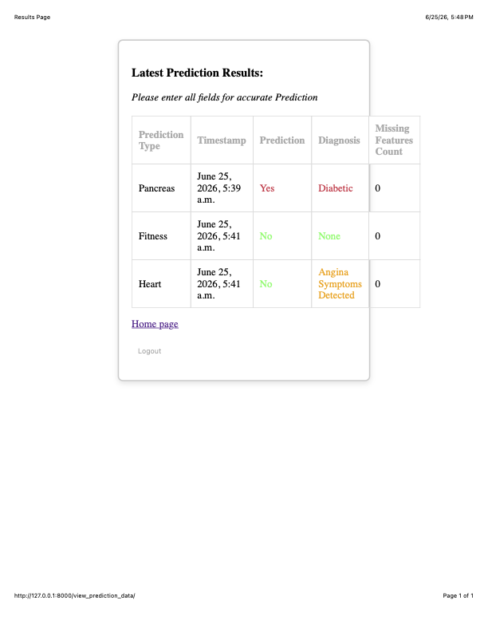

# AI-Powered Healthcare Analytics Platform

### DoctorSpot

A full-stack healthcare analytics platform that integrates machine learning models for disease prediction and patient health monitoring.


## 📚 Table of Contents

- [Overview](#-project-overview)
- [Features](#-features)
- [Technology Stack](#-tech-stack)
- [Machine Learning Models](#-supported-disease-prediction-models)
- [Screenshots](#-application-screenshots)
- [Installation](#-installation)
- [Project Highlights](#-project-highlights)
- [Project Statistics](#-project-statistics)
- [Future Improvements](#-future-improvements)

## Overview

DoctorSpot is an AI-powered healthcare analytics platform developed using Django, Python, MySQL, and Machine Learning. The application enables secure patient management, clinical data collection, health monitoring, and disease risk prediction through multiple trained machine learning models.

The platform provides healthcare professionals and users with an integrated dashboard for managing patient information, recording vital signs, generating predictive insights, and tracking historical health records, making it a comprehensive clinical decision-support solution.

  
## ✨ Features

### 👤 User Management
- Secure registration and login
- Session-based authentication
- Profile management

### 🩺 Patient Health Management
- Patient demographic records
- Vital signs tracking
- Automatic BMI calculation
- Health history management

### 🤖 AI Disease Prediction
- Heart Disease
- Diabetes
- Kidney Disease
- Liver Disease
- Lung Disease
- Lung Cancer
- Fitness Assessment

### 📊 Analytics
- Health score generation
- Prediction history
- Data quality scoring

## 🛠 Technology Stack

### Backend
- Python
- Django 5

### Machine Learning
- TensorFlow
- Keras
- Scikit-learn
- Pandas
- NumPy

### Database
- MySQL

### Frontend
- HTML5
- CSS3
- Bootstrap
- JavaScript

### Tools
- Git
- GitHub

## 🤖 Supported Disease Prediction Models

- Heart Disease Prediction
- Diabetes Prediction
- Kidney Disease Prediction
- Liver Disease Prediction
- Lung Disease Prediction
- Lung Cancer Prediction
- Fitness Assessment

## 📸 Application Screenshots

| Login | Dashboard |
|--------|-----------|
|  |  |

| Prediction History |
|--------------------|
|  |

## 🚀 Installation

```bash
git clone https://github.com/Thrishna124/DoctorSpot.git

cd DoctorSpot/docspot

python -m venv .venv

source .venv/bin/activate

pip install -r requirements.txt

python manage.py migrate

python manage.py runserver
```

## 🌟 Project Highlights

- Developed using Django 5 and Python
- Integrated multiple Machine Learning models
- Designed relational database using MySQL
- Secure authentication and authorization
- Dynamic patient dashboard
- Historical prediction tracking
- Modular architecture for scalable disease prediction

  ## 📈 Project Statistics

| Metric | Value |
|---------|------|
| Framework | Django 5.1 |
| Programming Language | Python |
| Database | MySQL |
| Machine Learning Models | 7 |
| Authentication | Django Authentication |
| Prediction History | ✔ |
| Health Dashboard | ✔ |
| BMI Calculation | ✔ |
| Patient Management | ✔ |


## 🚀 Future Enhancements

- Develop REST APIs using Django REST Framework
- Containerize the application with Docker
- Integrate Swagger/OpenAPI documentation
- Implement JWT-based authentication
- Add CI/CD using GitHub Actions
- Deploy to Google Cloud Platform or Render
- Introduce Redis caching and Celery for background tasks
- Build an interactive analytics dashboard

  ## 📄 License

This project is licensed under the MIT License.

## 👨‍💻 Author

**Thrishna Balakrishnan**

- GitHub: https://github.com/Thrishna124
- LinkedIn: https://www.linkedin.com/in/YOUR-LINKEDIN
  

  ## 📌 Repository

⭐ If you found this project interesting, feel free to star the repository.
